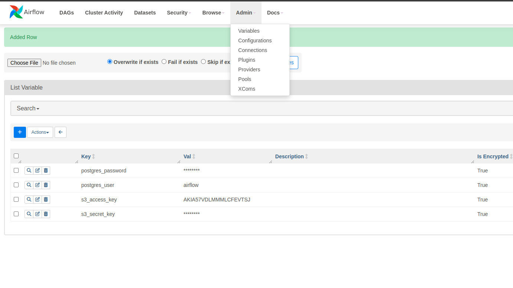

# Algolia-DE-Assignement

This repository's objective is to complete a Data Engineering Assignement as defined in `Algolia-Data_Engineer_Assignment.pdf`.

`docker-compose.yaml` file has been retrieved from [official Airflow repository](https://github.com/apache/airflow/blob/main/docs/apache-airflow/howto/docker-compose/docker-compose.yaml).
## Prerequisites

To use this project, you must have installed : 
* [Docker Compose](https://docs.docker.com/compose/install/)

You will also need AWS credentials.

## Build 

In project's folder, run 

```console
> docker compose up
```

## Check Environement

### Airflow

To check if Airflow is properly running, open a browser at `http://localhost:8080/home`

Default credentials should be `airflow`:`airflow`.

### PostgreSQL

To check if Postgres is running and data are loaded, run the following commands : 

```console
# PREFIX depends on the name of the parent folder when you ran docker compose. You can list containers with `docker ps -a` 
> docker exec -it [PREFIX]-postgres-1 bash 
> psql -h localhost -U airflow

# List all databases on postgres
> \l 
```
## Configure

### Credentials 
To retrieve data from AWS bucket, and store data to postgres you will need to configure credentials in Airflow.

To do so, setup variables in Airflow UI : 


Note : we should be able to access public bucket without credentials, but for some reasons it is not working at the time I write this README.

## Run 

Once the environment is built and configured, you can run the pipeline (finally !).

Open a browser at `http://localhost:8080/home` and run `shopify_configuration_2_postgres` DAG.
